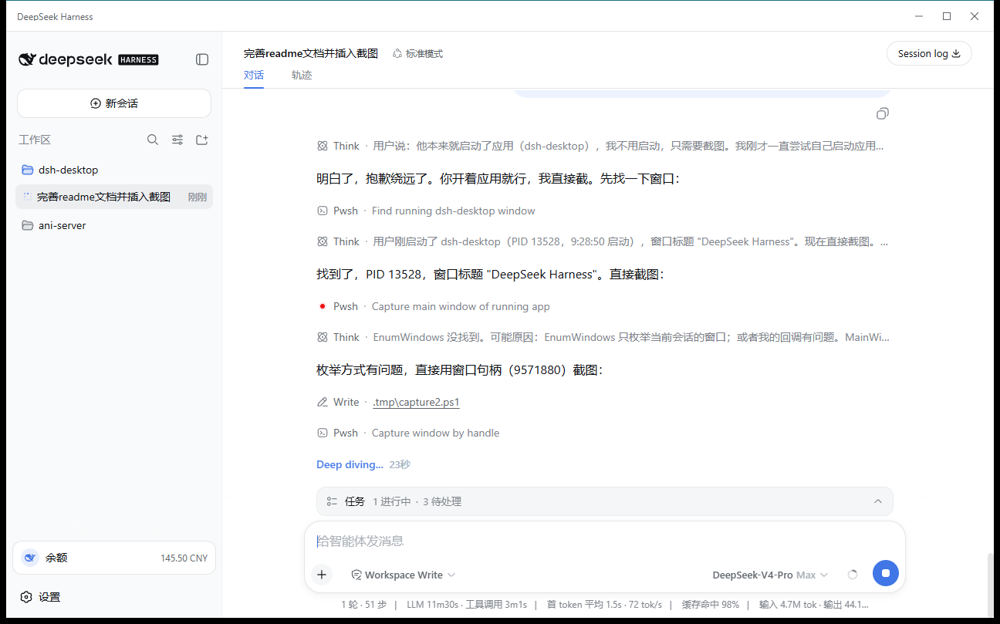
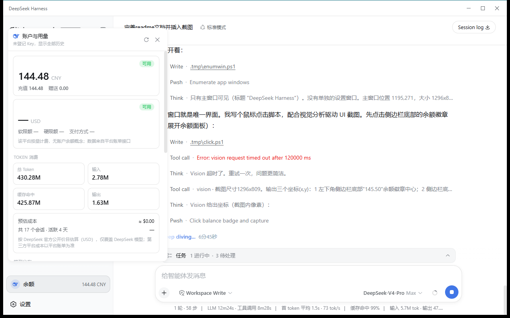
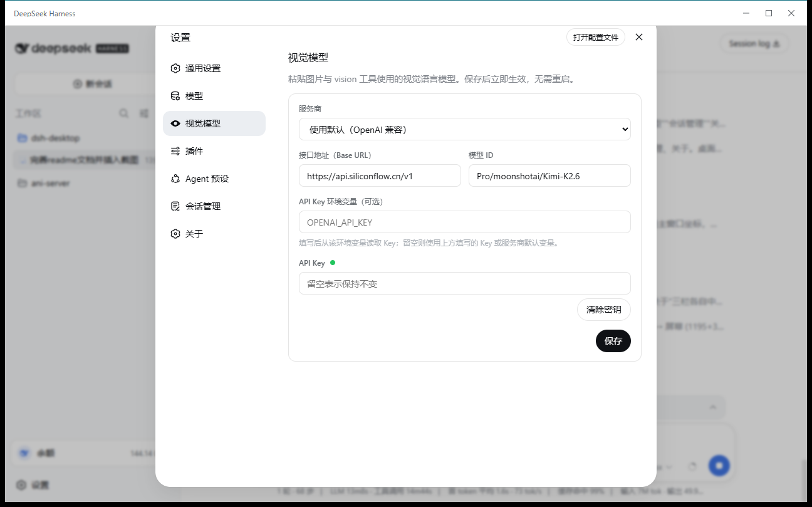
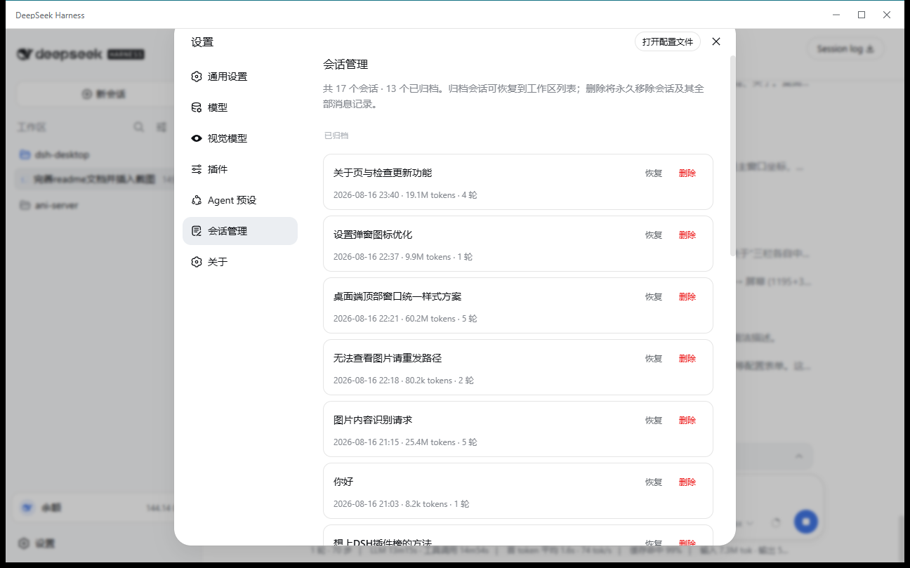
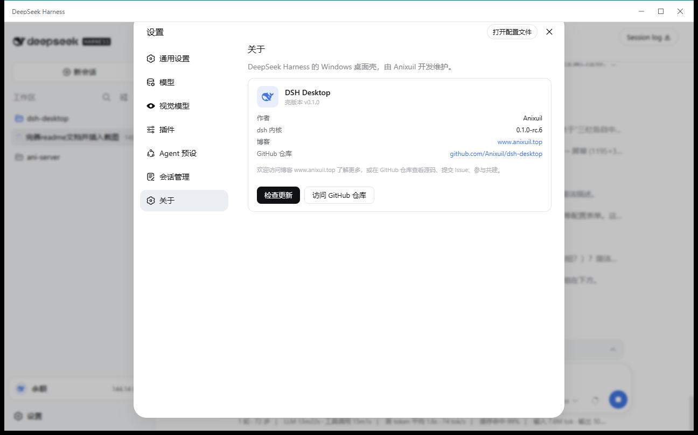

# DSH Desktop

[](https://github.com/Anixuil/dsh-desktop/releases)
[](https://github.com/Anixuil/dsh-desktop/stargazers)
[](LICENSE)
[]()
[](https://github.com/topics/dsh-plugin)

**DeepSeek Harness 的 Windows 桌面客户端**（第三方社区项目）。

把命令行版 [DeepSeek Harness](https://github.com/deepseek-ai/deepseek-harness) 变成真正的桌面应用：**安装即用，零环境要求**——内置 Node.js 运行时与 dsh 内核，用户不需要安装 Node、不需要碰终端，双击打开就是完整界面。

> 鲸鱼图标取自 `@deepseek-ai/dsh` 官方 favicon，其版权归 DeepSeek 所有。
> 本项目与 DeepSeek 官方无关，MIT 协议开源；仓库不含 dsh 运行时本体
> （构建时通过脚本从 npm 官方源下载）。

## ✨ 特性

- **装完即用**：NSIS 安装包内置 Node 便携版 + dsh 内核 + WebView2 壳，目标机器零依赖
- **壳核分离**：以子进程方式运行官方 `dsh web`，主窗口直接承载 DSH 原生界面；命令行版的会话、配置、插件生态全部共享（默认 `~/.dsh`）；若检测到命令行 DSH 已在运行，自动接入该实例而不是抢占端口
- **API Key 管理**：设置页输入即校验，Key 存入 Windows 凭据管理器并同步给 DSH；
  每次登记新 Key 都会重置 DSH 的"自登记以来消耗"统计窗口
- **多平台账户监控**：侧边栏内置「账户与用量」面板，一次刷新同时呈现所有已配置平台的账户状态——
  DeepSeek 官方余额（总/充值/赠送）、OpenAI 兼容网关的按量账单（本月用量/软硬限额/支付方式）、
  其他平台的状态提示；还聚合 Token 消耗统计与成本估算。刷新时机：保存 Key 时、每 60 秒、
  托盘手动、以及每轮对话结束后（桥接插件监听 `agent/status`）；托盘常驻实时余额，低于阈值自动标红
- **内核自动更新**：官方 dsh 发布新版本自动检测（npm 官方源），一键更新、
  更新完自动重启服务立即生效；新内核 60 秒健康验证，**起不来自动回滚旧版**（验证状态跨重启保留）
- **内置识图插件**：预装 [dsh-vision-any](https://github.com/tianmingwan/dsh-vision-any)，
  开箱即可在对话中粘贴/拖拽图片，并在设置页提供「视觉模型」配置分页，
  配合任意 OpenAI 兼容 / Anthropic / Gemini 视觉 API 让纯文本模型"看图"（[配置方法](#识图配置)）
- **会话管理**：设置 →「会话管理」分页，查看全部会话（Token 数 / 轮数）、
  一键恢复归档会话、彻底删除会话（含派生缓存）
- **应用内集成**：向 DSH 设置页注入「视觉模型 / 会话管理 / 关于」三个分页（带专属导航图标），
  「关于」页展示壳与内核版本、作者、博客 / GitHub 入口和检查更新
- **壳自动更新检测**：配置 GitHub 仓库后，启动即查 + 每 6 小时复查（[配置教程](#壳自动更新)）
- **桌面体验**：自定义无边框标题栏、明暗主题切换的 DeepSeek 海浪过场动画、
  首次启动解压进度的启动页、系统托盘（余额/打开/设置/退出）、关闭窗口最小化到托盘、
  单实例锁、崩溃自动重启、日志落盘、开机自启

## 🖼️ 截图

**主界面**（自绘标题栏，直接承载 DSH 原生界面）：



**侧边栏「账户与用量」面板**（多平台余额/账单 + Token 统计与成本估算）：



**设置页的桌面专属分页**（注入 DSH 设置弹窗）：

| 视觉模型（识图配置） | 会话管理（恢复/删除） | 关于（版本与更新） |
|---|---|---|
|  |  |  |

桌面设置窗口（API Key / 余额 / 自动更新 / 诊断）可从托盘右键 →「设置 / API Key」打开。

## 📦 安装

1. 到 [Releases](https://github.com/Anixuil/dsh-desktop/releases) 下载 `DSH Desktop_*.exe`；
2. 双击安装（用户级安装，无需管理员）；
3. 打开应用。**首次启动约 1 分钟**（解压内置运行时，界面有进度提示），之后秒开。

> 提示：若命令行版 DSH 正在运行（占用 3080 端口），桌面版会自动接入该实例并共享会话；
> 想要「对话后实时刷新余额」，请先退出命令行 DSH，让桌面版自托管内核。

## 🖼️ 识图配置

桌面版**内置** [dsh-vision-any](https://github.com/tianmingwan/dsh-vision-any) 插件，
无需任何安装操作。它做两件事：

1. **粘贴准入**：纯文本模型也能在聊天框粘贴/拖拽图片，图片自动落到本地并变成路径提示；
2. **`vision` 工具**：Agent 用该路径调用 `vision`，由你配置的视觉模型返回文字描述。

要启用识图，只需配置一个视觉模型（配置文件优先，其次环境变量，最后内置默认值）：

- **应用内设置**（推荐）：主界面左下角设置 →「视觉模型」分页，填服务商/接口地址/模型 ID/API Key 即可
  （界面见上方[截图](#截图)的「视觉模型」）；

- **配置文件**：等价地，创建 `C:\Users\<你>\.config\dsh-vision-any\config.json`：

  ```json
  {
    "provider": "openai",
    "openai": {
      "baseUrl": "https://opencode.ai/zen/go/v1",
      "model": "mimo-v2.5",
      "apiKeyEnv": "OPENCODE_GO_API_KEY"
    }
  }
  ```

  常见组合速查（改 `baseUrl` / `model` / `apiKeyEnv` 即可）：

  | 想用哪个 | provider | baseUrl | model |
  |---|---|---|---|
  | OpenCode Go / MiMo | `openai` | `https://opencode.ai/zen/go/v1` | `mimo-v2.5` |
  | 通义千问 | `openai` | `https://dashscope.aliyuncs.com/compatible-mode/v1` | `qwen-vl-plus` |
  | OpenAI | `openai` | `https://api.openai.com/v1` | `gpt-4o-mini` |
  | Claude | `anthropic` | `https://api.anthropic.com` | `claude-sonnet-4-5` |
  | Gemini | `gemini` | `https://generativelanguage.googleapis.com/v1beta` | `gemini-2.0-flash` |
  | 本地 Ollama | `openai` | `http://localhost:11434/v1` | `llava` |

- **环境变量**：如 `VISION_ANY_PROVIDER`、`VISION_ANY_BASE_URL`、`VISION_ANY_MODEL`、
  `VISION_ANY_API_KEY`（也可直接用上表各家的 `*_API_KEY`）。
- **什么都不配**：插件自带 OpenAI 兼容默认值（`api.openai.com` + `OPENAI_API_KEY`）。

配置后**重启桌面版**（托盘退出再打开）即生效；粘贴图片后 Agent 会自动调用 `vision`。
更多参数（多图上限、超时等）见[上游文档](https://github.com/tianmingwan/dsh-vision-any)。

## 🚀 使用

| 操作 | 入口 |
|---|---|
| 查看余额/账单/Token 统计 | 侧边栏底部余额徽章 →「账户与用量」面板 |
| 配置 API Key / 查看余额 | 托盘右键 →「设置 / API Key」（桌面设置窗口） |
| 配置识图模型 | 应用内设置 →「视觉模型」分页（或[配置文件](#识图配置)） |
| 恢复归档 / 删除会话 | 应用内设置 →「会话管理」分页 |
| 版本信息 / 检查更新 | 应用内设置 →「关于」分页 |
| 检查更新 / 更新 dsh 内核 | 桌面设置窗口「自动更新」卡片 |
| 开机自启 | 桌面设置窗口勾选 |
| 打开日志 | 桌面设置窗口「诊断」或 `%APPDATA%\com.anixuil.dshdesktop\logs\dsh.log` |
| 退出（停止内核） | 托盘右键 →「退出」（关闭窗口只是最小化） |

## ⚙️ 工作原理

```
DSH Desktop（Tauri 2 壳，Windows）
├─ 进程管理：spawn 内置 node + dsh web → 健康检查 → 主窗口加载 127.0.0.1:3080
├─ 桥接插件 dsh-desktop-bridge（--patch 注入 dsh）
│   ├─ 对话结束（agent/status→idle）→ 通知壳刷新余额
│   ├─ 接收壳下发的 API Key → 写入 DSH credentials
│   └─ 同源 /desktop 路由：余额面板代理、Token 消费统计、关于页
├─ 会话管理插件 dsh-desktop-session-manager（--patch 注入 dsh）
│   └─ /desktop-sessions 路由：会话列表（归档标记）/ 恢复归档 / 彻底删除
├─ 内置插件 dsh-vision-any（写入 web profile 的 bundles，粘贴识图）
├─ 设置页集成：给「视觉模型 / 会话管理 / 关于」分页注入专属导航图标
│   （幂等 patch 上游设置壳 bundle，锚点丢失时优雅降级）
├─ 更新：dsh 内核（npm 官方源 + 60s 健康验证 + 自动回滚，跨重启保留验证状态）
│   与壳（GitHub Releases 检测 + 引导下载）
└─ 无边框标题栏 / 主题切换动画 / 启动页 / 托盘 / 单实例 / 日志 / 自启
```

- 端口：dsh web `3080`；壳监听 `38657`（对话结束通知/余额面板代理）；桥接插件 `38658`（Key 写入）
- 数据：`DSH_HOME` 默认 `~/.dsh`，与命令行版完全共享；两个桌面插件每次启动时从内置副本同步到 profile 树，dsh 内核更新后也会自动恢复

## 🔄 壳自动更新

1. 用 [gh](https://cli.github.com/) 发布安装包：
   `gh release create v0.2.0 "安装包路径" --repo 你的账号/你的仓库`
2. 配置更新源（二选一）：
   - `%APPDATA%\com.anixuil.dshdesktop\config.json` 写入 `{"updateRepo": "账号/仓库"}`
   - 或设环境变量 `DSH_DESKTOP_UPDATE_REPO=账号/仓库`
3. 重启应用。检测到新 tag 时设置页会提示"应用有新版 x → y"。

以后发版：改 `tauri.conf.json` 的 version → `npm run build` → 用 gh 发对应 tag 的 Release。

## 🛠 从源码构建

要求：Windows 10/11 x64、Node.js ≥ 20、pnpm/npm、Rust（MSVC 工具链）、Visual Studio 2022 C++ 工具。

```powershell
npm install
node scripts/fetch-runtime.mjs        # 组装 Node 便携版 + dsh 内核
node scripts/make-runtime-archive.mjs # 打包运行时归档
npm run dev                           # 开发运行
npm run build                         # 产出 NSIS 安装包
```

完整构建说明（含环境细节与发布清单）见 [`docs/BUILDING.md`](docs/BUILDING.md)。

## 📁 项目结构

| 路径 | 内容 |
|---|---|
| `src-tauri/src/lib.rs` | 壳全部逻辑（进程/健康检查/多平台余额/托盘/更新回滚/自启） |
| `ui/` | 启动页与桌面设置窗口（纯静态，无构建步骤） |
| `scripts/bridge/` | `dsh-desktop-bridge` Cordis 插件（`--patch` 注入 dsh；含余额面板/关于页/Token 统计前端模块） |
| `scripts/session-manager/` | `dsh-desktop-session-manager` Cordis 插件（会话列表/恢复归档/彻底删除） |
| `scripts/fetch-runtime.mjs` | 下载/组装运行时（含内置 dsh-vision-any，固定 commit） |
| `scripts/make-runtime-archive.mjs` | 打包运行时单归档（安装提速） |
| `scripts/make-whale-icon.mjs` 等 | 图标提取与光栅化 |
| `docs/screenshots/` | README 用截图 |

## ⚠️ 已知限制

- 安装包未做代码签名（SmartScreen 可能提示"未知发布者"，点"仍要运行"即可）
- 识图依赖你自备的第三方视觉 API（Key 走配置文件/环境变量，桌面版只负责内置插件）
- 壳更新目前是"检测 + 引导下载"，未做应用内一键安装
- 仅支持 Windows；macOS/Linux 待规划

## 📄 许可证

[MIT](LICENSE) © 2026 Anixuil

DeepSeek、DeepSeek Harness 及其鲸鱼标志归 DeepSeek 所有；本项目为独立社区项目。
