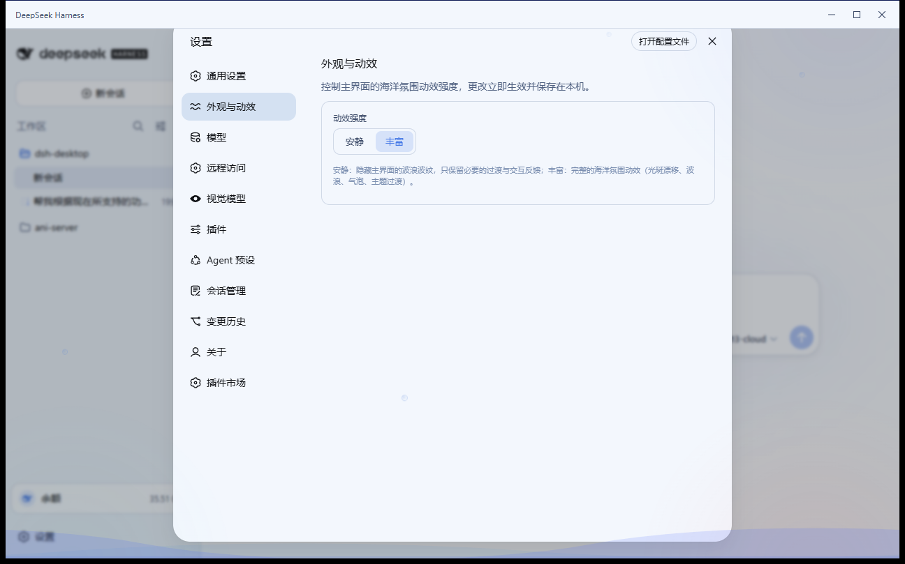
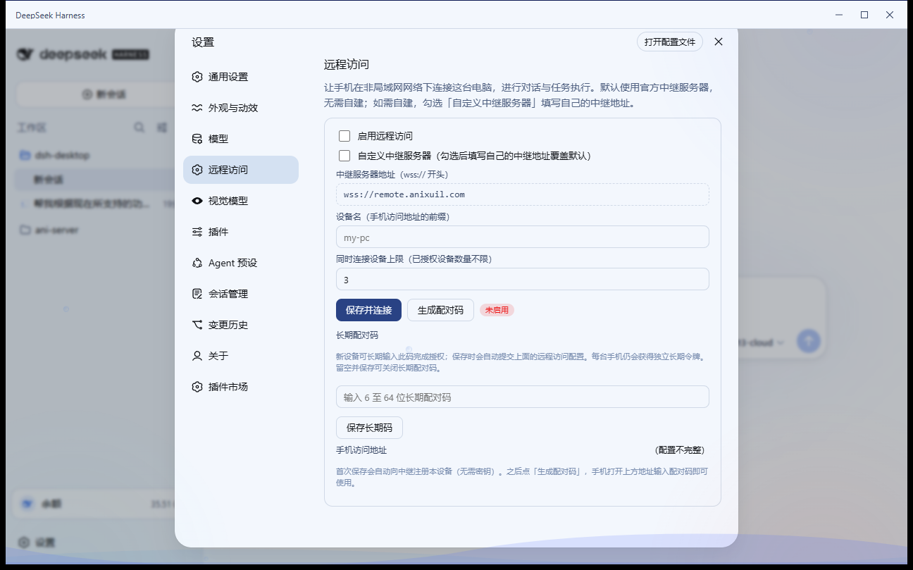
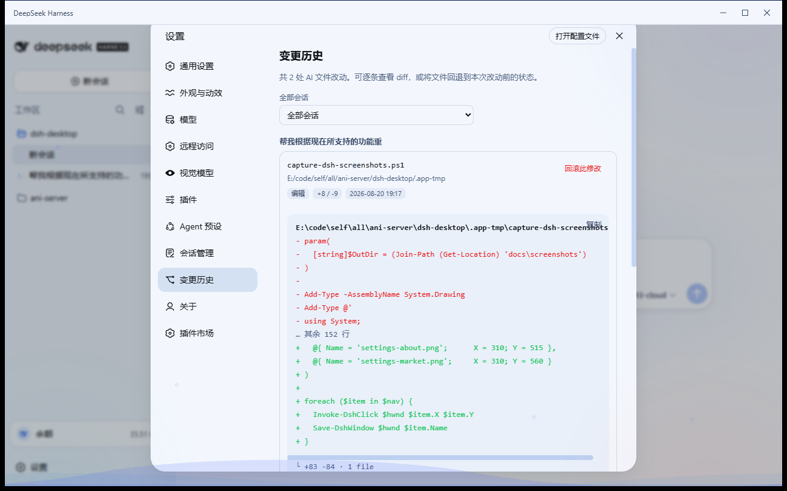
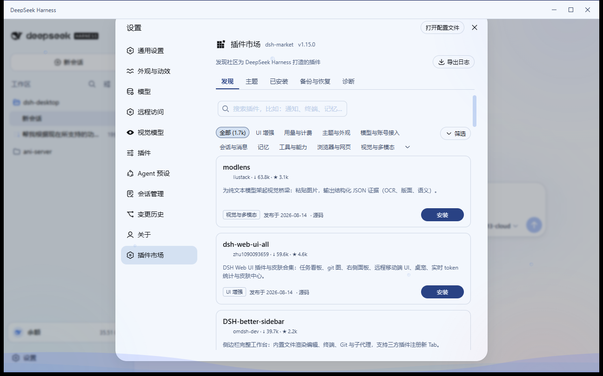

# DSH Desktop

[](https://github.com/Anixuil/dsh-desktop/releases)
[](https://github.com/Anixuil/dsh-desktop/stargazers)
[](LICENSE)
[]()
[](https://github.com/topics/dsh-plugin)

**DeepSeek Harness 的 Windows 桌面客户端**（第三方社区项目）。

它把命令行版 [DeepSeek Harness](https://github.com/deepseek-ai/deepseek-harness) 封装成安装即用的桌面应用：内置 Node.js 运行时、dsh 内核、桌面桥接插件、会话管理、变更历史、识图插件和插件市场。用户不需要安装 Node，也不需要碰终端，双击打开就是完整界面。

> 鲸鱼图标取自 `@deepseek-ai/dsh` 官方 favicon，其版权归 DeepSeek 所有。
> 本项目与 DeepSeek 官方无关，MIT 协议开源；仓库不含 dsh 运行时本体，构建时通过脚本从 npm 官方源下载。

## 功能概览

### 桌面体验

- **安装即用**：NSIS 安装包内置 Node 便携版、dsh 内核、WebView2 壳和桌面插件，目标机器零环境要求。
- **壳核分离**：以子进程运行官方 `dsh web`，主窗口承载 DSH 原生界面；默认共享 `~/.dsh`，与命令行版复用会话、配置和插件生态。
- **已有实例接管**：如果检测到命令行 DSH 已运行并占用 `3080` 端口，桌面版会接入该实例，而不是抢占端口。
- **海洋主题**：亮色模式为海玻璃蓝调，暗色模式为深海色调；同时注入波浪、气泡、光晕等环境动画层。
- **会话状态动画**：环境动画会响应对话状态，例如思考、流式输出、工具调用、等待确认、错误和结束退潮。
- **无边框标题栏**：自绘标题栏，支持最小化、最大化、关闭，并跟随 DSH 明暗主题切换。
- **主题切换过场**：明暗切换时播放 DeepSeek 海浪过场动画；安静模式下即时切换。
- **启动页**：首次启动显示解压进度，之后秒开。
- **系统托盘**：余额显示、打开主窗口、设置、刷新余额、检查更新、开机自启、退出；关闭窗口默认最小化到托盘。
- **单实例锁**：防止重复启动。
- **崩溃自动重启**：dsh 进程异常退出后自动拉起。
- **日志落盘**：运行日志写入 `%APPDATA%\com.anixuil.dshdesktop\logs\dsh.log`。
- **开机自启**：支持静默启动到托盘并预热服务。

### 账户与用量

- **多平台账户监控**：侧边栏「账户与用量」面板会汇总已配置平台的账户状态：
  - DeepSeek 官方余额。
  - 火山引擎账户余额。
  - OpenAI 兼容网关的按量账单。
  - 其他平台的状态提示。
- **Token 消费统计**：展示总 Token、输入、缓存命中、输出、模型分布、近 14 天趋势、最近会话和成本估算。
- **自动刷新**：保存 Key 时、每 60 秒、托盘手动刷新、每轮对话结束后自动刷新。
- **API Key 管理**：API Key 在 DSH 原生设置页的「模型」中统一管理；桌面版会读取 DSH 凭据并同步余额状态。

### 会话与变更管理

- **会话管理**：设置 →「会话管理」可查看全部会话、恢复归档会话、彻底删除会话；侧边栏会话菜单也提供「永久删除」。
- **变更历史**：自动追踪 Agent 的 `write` / `edit` 操作，生成 diff 并持久化；设置 →「变更历史」可查看记录、按会话筛选、标记已审阅、回滚文件。
- **对话内文件查看器**：对话中的变更行可打开右侧文件查看器，查看当前文件内容。

### 远程访问

- **手机远程连接**：通过中继服务器让手机在非局域网下访问 PC 上的 DSH Desktop。
- **默认公共中继**：开箱使用 `wss://remote.anixuil.com`，也可以勾选「自定义中继服务器」填写自己的中继地址。
- **设备注册**：首次保存远程访问配置时自动向中继注册设备，无需手动填写共享密钥。
- **配对码 + 二维码**：生成 6 位配对码和二维码，手机扫码即可接入。
- **长期配对码**：可设置 6 至 64 位长期配对码，新设备可长期使用该码完成授权。
- **并发控制**：可设置同时连接设备上限。
- **协议透明**：relay 只转发 HTTP 和 WebSocket 帧，不解析 dsh 协议，dsh 升级对远程访问影响小。

### 更新与插件

- **dsh 内核自动更新**：从 npm 官方源检测新版本，一键更新，更新后自动重启；新内核 60 秒健康验证，失败自动回滚。
- **壳自动更新检测**：启动时和每 6 小时检查 GitHub Releases。
- **CLI 生态兼容**：默认共享 `~/.dsh`，复用已有 CLI 配置、会话和兼容插件；内置第三方插件检测到用户已安装同名包时会复用，不覆盖用户版本。
- **内置识图插件**：预装 `dsh-vision-any`，支持粘贴/拖拽图片，并在设置页提供「视觉模型」配置。
- **内置插件市场**：预装 `dshmarket`，可在设置 →「插件市场」浏览和安装社区插件。

### 应用内设置页

桌面版向 DSH 设置页注入以下页面：

| 页面 | 功能 |
|---|---|
| 外观与动效 | 切换动画强度：安静 / 丰富 |
| 远程访问 | 配置中继、设备名、并发上限、配对码、二维码、长期配对码 |
| 视觉模型 | 配置识图插件 provider / baseUrl / model / API Key |
| 会话管理 | 查看、恢复、删除会话 |
| 变更历史 | 查看 diff、标记已审阅、回滚变更 |
| 关于 | 查看壳与内核版本、作者、博客、GitHub、检查更新 |
| 插件市场 | 浏览和安装社区插件 |

## 截图

**主界面**：


**账户与用量面板**：


**设置页桌面功能**：

| 外观与动效 | 远程访问 | 视觉模型 |
|---|---|---|
|  |  |  |

| 会话管理 | 变更历史 | 关于 |
|---|---|---|
|  |  |  |

**插件市场**：



桌面设置窗口可从托盘右键 →「设置」打开，包含运行状态、余额、远程访问、更新、诊断和关于。

## 安装

1. 到 [Releases](https://github.com/Anixuil/dsh-desktop/releases) 下载 `DSH Desktop_*.exe`。
2. 双击安装，用户级安装，无需管理员。
3. 打开应用。首次启动约 1 分钟，界面会显示解压进度；之后秒开。

> 如果命令行版 DSH 正在运行并占用 `3080` 端口，桌面版会自动接入该实例并共享会话。
> 想要「对话后实时刷新余额」，请先退出命令行 DSH，让桌面版自托管内核。

## 使用入口

| 操作 | 入口 |
|---|---|
| 查看余额、账单、Token 统计 | 侧边栏底部余额徽章 →「账户与用量」面板 |
| 配置 API Key | DSH 左下角「设置 → 模型」 |
| 手机远程访问这台电脑 | 应用内设置 →「远程访问」；或托盘右键 →「设置」→「远程访问」 |
| 配置识图模型 | 应用内设置 →「视觉模型」 |
| 切换动画强度 | 应用内设置 →「外观与动效」 |
| 恢复归档 / 删除会话 | 应用内设置 →「会话管理」；或侧边栏会话菜单「永久删除」 |
| 查看变更历史 / 回滚文件 | 应用内设置 →「变更历史」 |
| 浏览插件市场 | 应用内设置 →「插件市场」 |
| 版本信息 / 检查更新 | 应用内设置 →「关于」；或托盘右键 →「设置」→「更新」 |
| 更新 dsh 内核 | 托盘右键 →「设置」→「更新」 |
| 开机自启 | 托盘右键 →「设置」→「更新」 |
| 打开日志 | 托盘右键 →「设置」→「诊断」 |
| 退出并停止内核 | 托盘右键 →「退出」；关闭窗口只是最小化 |

## 识图配置

桌面版内置 `dsh-vision-any`，无需额外安装。它做两件事：

1. 让纯文本模型也能在聊天框粘贴/拖拽图片，图片会落到本地并变成路径提示。
2. Agent 使用该路径调用 `vision` 工具，由你配置的视觉模型返回文字描述。

推荐在应用内设置 →「视觉模型」中配置：

- `provider`：`openai`、`anthropic`、`gemini`。
- `baseUrl`：视觉 API 地址。
- `model`：视觉模型 ID。
- `apiKeyEnv` 或 `apiKey`：API Key 环境变量名或直接填写 Key。

保存后立即生效，无需重启桌面版。

也可以使用配置文件 `C:\Users\<你>\.config\dsh-vision-any\config.json`：

```json
{
  "provider": "openai",
  "openai": {
    "baseUrl": "https://api.openai.com/v1",
    "model": "gpt-4o-mini",
    "apiKeyEnv": "OPENAI_API_KEY"
  }
}
```

常见组合速查：

| 想用哪个 | provider | baseUrl | model |
|---|---|---|---|
| OpenAI | `openai` | `https://api.openai.com/v1` | `gpt-4o-mini` |
| 通义千问 | `openai` | `https://dashscope.aliyuncs.com/compatible-mode/v1` | `qwen-vl-plus` |
| Claude | `anthropic` | `https://api.anthropic.com` | `claude-sonnet-4-5` |
| Gemini | `gemini` | `https://generativelanguage.googleapis.com/v1beta` | `gemini-2.0-flash` |
| 本地 Ollama | `openai` | `http://localhost:11434/v1` | `llava` |

## 远程访问

桌面版内置 relay 客户端，默认使用公共中继，也可以自建中继：

1. 应用内设置 →「远程访问」。
2. 勾选「启用远程访问」。
3. 填写设备名，例如 `my-pc`。
4. 点击「保存并连接」，首次保存会自动注册设备。
5. 点击「生成配对码」，手机打开访问地址并输入配对码。

如需自建中继，勾选「自定义中继服务器」，填写自己的 `wss://` 地址。中继服务端代码在 [`scripts/relay/`](scripts/relay/README.md)。

```
手机浏览器  ──https/wss──▶  中继服务器（relay + caddy）  ◀──wss 出站长连──  PC (DSH Desktop)
```

## 工作原理

```
DSH Desktop（Tauri 2 壳，Windows）
├─ 进程管理：spawn 内置 node + dsh web → 健康检查 → 主窗口加载 127.0.0.1:3080
├─ 海洋主题注入：CSS 设计令牌重着色 + 环境动画层
├─ 会话状态驱动：监听 session 事件流，映射为环境动画状态
├─ 桥接插件 dsh-desktop-bridge
│   ├─ 对话结束通知壳刷新余额
│   ├─ 同源 /desktop 路由：余额、用量、外观、远程访问、关于、更新
│   └─ 注入设置页：外观与动效 / 远程访问 / 关于
├─ 会话管理插件 dsh-desktop-session-manager
│   └─ /desktop-sessions 路由 + 设置页：会话列表 / 恢复归档 / 彻底删除
├─ 变更历史插件 dsh-desktop-change-history
│   └─ /desktop-changes 路由 + 设置页：diff / 审阅 / 回滚 / 文件查看器
├─ 内置识图插件 dsh-vision-any
│   └─ 图片粘贴 / vision 工具 / 视觉模型设置页
├─ 内置插件市场 dshmarket
│   └─ 设置页「插件市场」浏览和安装社区插件
├─ 远程访问：relay-client 伴随进程
│   └─ wss 出站连接中继，转发 HTTP/WS
└─ 无边框标题栏 / 主题切换动画 / 启动页 / 托盘 / 单实例 / 日志 / 自启
```

- 端口：dsh web `3080`；壳监听 `38657`；桥接插件 `38658`；relay-client 状态 `38659`。
- 数据：`DSH_HOME` 默认 `~/.dsh`，与命令行版共享。
- 变更历史存储：`$DSH_HOME/desktop/changes/`。

## 壳自动更新

1. 用 [gh](https://cli.github.com/) 发布安装包：
   `gh release create v0.2.0 "安装包路径" --repo 你的账号/你的仓库`
2. 配置更新源：
   - `%APPDATA%\com.anixuil.dshdesktop\config.json` 写入 `{"updateRepo": "账号/仓库"}`
   - 或设置环境变量 `DSH_DESKTOP_UPDATE_REPO=账号/仓库`
3. 重启应用。检测到新 tag 时设置页会提示「应用有新版」。

以后发版：改 `tauri.conf.json` 的 version → `npm run build` → 用 gh 发对应 tag 的 Release。

## 从源码构建

要求：Windows 10/11 x64、Node.js ≥ 20、pnpm/npm、Rust MSVC 工具链、Visual Studio 2022 C++ 工具。

```powershell
npm install --cache .npm-cache
node scripts/fetch-runtime.mjs        # 组装 Node 便携版 + dsh 内核 + 插件
node scripts/make-runtime-archive.mjs # 打包运行时归档
npm run build:plugins                 # 重建桌面插件客户端 bundle
npm run dev                           # 开发运行
npm run build                         # 产出 NSIS 安装包
```

完整构建说明见 [`docs/BUILDING.md`](docs/BUILDING.md)。

## 项目结构

| 路径 | 内容 |
|---|---|
| `src-tauri/src/lib.rs` | 壳逻辑：进程、健康检查、余额、远程访问、托盘、更新回滚、自启、主题注入 |
| `ui/` | 启动页与桌面设置窗口 |
| `scripts/bridge/` | `dsh-desktop-bridge` 插件：余额面板、用量统计、外观、远程访问、关于 |
| `scripts/session-manager/` | `dsh-desktop-session-manager` 插件：会话列表、恢复归档、删除 |
| `scripts/change-history/` | `dsh-desktop-change-history` 插件：变更追踪、diff、回滚、文件查看器 |
| `scripts/vision-any/` | 内置识图插件桌面叠加层 |
| `scripts/relay/` | 中继服务器 |
| `scripts/relay-client/` | PC 侧中继客户端 |
| `scripts/fetch-runtime.mjs` | 下载/组装运行时 |
| `scripts/make-runtime-archive.mjs` | 打包运行时归档 |
| `scripts/sync-runtime-plugins.mjs` | 同步桌面插件到 runtime |
| `scripts/sync-vision-any.mjs` | 同步识图插件叠加层 |
| `scripts/test-*.mjs` | 插件、桥接、relay、UI 测试 |
| `docs/screenshots/` | README 截图 |

## 已知限制

- 安装包未做代码签名，SmartScreen 可能提示「未知发布者」。
- 识图依赖你自备的第三方视觉 API。
- 远程访问默认使用公共中继，服务可能不稳定；建议有条件的用户自建中继。
- 远程访问当前无端到端加密，对话内容会经中继转发。
- 壳更新目前是「检测 + 引导下载」，未做应用内一键安装。
- 仅支持 Windows；macOS/Linux 待规划。

## 许可证

[MIT](LICENSE) © 2026 Anixuil

DeepSeek、DeepSeek Harness 及其鲸鱼标志归 DeepSeek 所有；本项目为独立社区项目。
